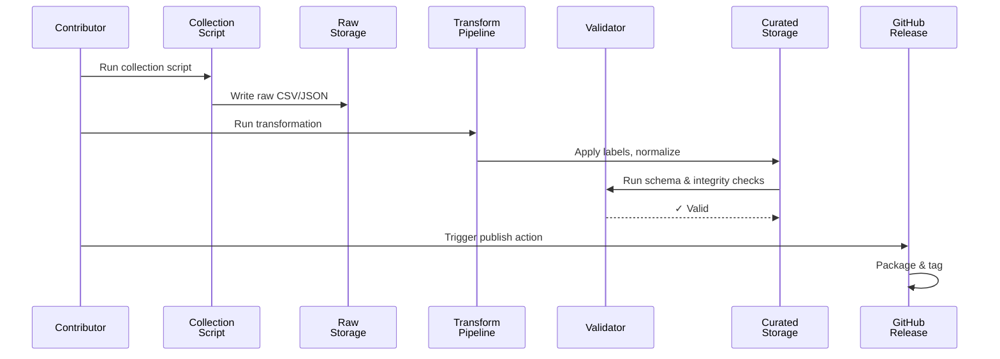
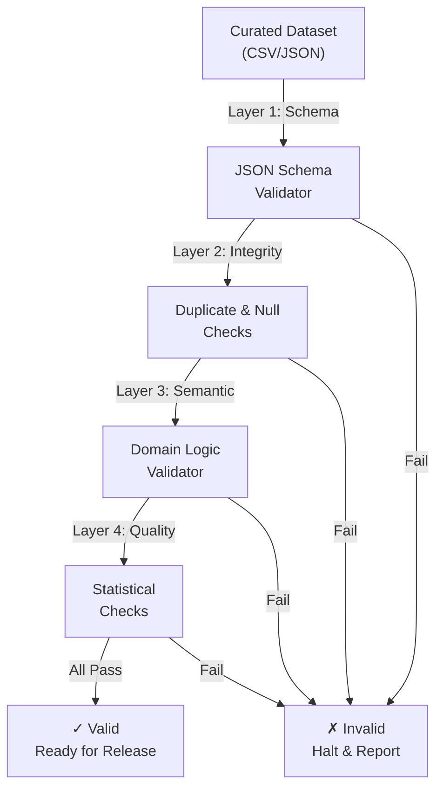
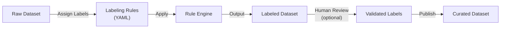
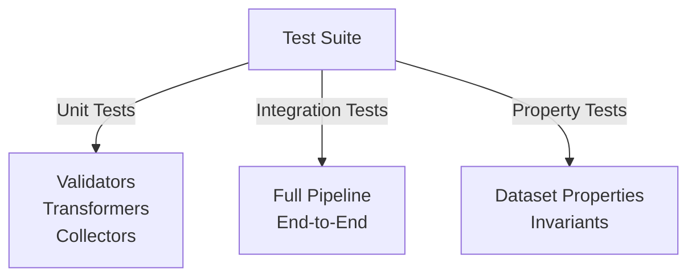

# Design Document: StellarDataLab

## Overview

StellarDataLab is a minimal, file-based open-source research and data repository for the Stellar ecosystem. It provides a structured pipeline for collecting, curating, validating, and publishing datasets for blockchain research, fraud detection, network monitoring, and ML applications. The system prioritizes maintainability over features—a single maintainer can curate datasets, run validations, and publish to GitHub within a predictable workflow. All data flows through a simple Python pipeline backed by CSV/JSON storage and GitHub Actions for CI/CD.

The design philosophy is: use boring, proven technology; store data as immutable files in Git; validate early and often; keep contributor barriers low.

## 1. Repository Architecture & Philosophy

### Core Principles

1. **File-based, not database-driven**: All data lives in Git as CSV/JSON. No databases, no cloud infrastructure. Immutability and auditability are built-in.
2. **Python pipeline, not microservices**: Single Python module orchestrates collection, validation, labeling, and export. Runnable locally and via GitHub Actions.
3. **Minimal, boring tech stack**: Python, CSV, JSON, Markdown, GitHub. Reduces maintenance burden and lowers contributor friction.
4. **Contributor-first onboarding**: New contributors add datasets by creating a YAML metadata file and CSV/JSON data. The pipeline handles the rest.
5. **Validation-as-contract**: Every dataset has a schema and validation rules. CI/CD enforces these automatically.
6. **Research transparency**: All labeling decisions, transformations, and data lineage are documented alongside the data.

### Architectural Diagram

```mermaid
graph LR
    A["Raw Data Sources<br/>(CSV, JSON, APIs)"] -->|"Fetch & Normalize"| B["Data Collection<br/>(scripts/)"]
    B -->|"Store Raw"| C["Raw Datasets<br/>(datasets/raw/)"]
    C -->|"Transform & Label"| D["Curation Pipeline<br/>(pipeline/)"]
    D -->|"Validate Schema"| E["Validation Engine<br/>(validators/)"]
    E -->|"Publish"| F["Curated Datasets<br/>(datasets/curated/)"]
    F -->|"CI/CD"| G["GitHub Releases<br/>& Registry"]
    G -->|"Download & Use"| H["Researchers & ML"]
```



### Why This Architecture Fits MVP

- **Single maintainer**: No async systems, no queues, no distributed state. Run scripts locally or via GitHub Actions.
- **Weeks, not months**: Reuses CSV/JSON parsing, minimal custom tooling. Leverage pandas, pydantic for heavy lifting.
- **Auditable**: Git history is the audit log. Every change is tracked and reversible.
- **Low operational risk**: No infrastructure to deploy. CI/CD is GitHub Actions. Data is immutable in Git.

### Over-Engineering Risks to Avoid

- **Databases**: Use Git + CSV instead. Adds complexity, operational overhead, and maintainability burden.
- **Cloud infrastructure** (S3, BigQuery, etc.): Use GitHub Releases for large files. Adds cost and vendor lock-in.
- **Event streaming / Kafka**: Use GitHub Actions scheduled jobs. Simpler, more reliable for research workflows.
- **API servers / REST endpoints**: Publish static datasets instead. Researchers download and use locally.
- **Real-time monitoring**: Batch validation on schedule. Research doesn't require sub-second latency.

---

## 2. Directory Structure

```
StellarDataLab/
├── README.md                           # Project overview, quick start
├── CONTRIBUTING.md                     # Contributor guidelines
├── RESEARCH.md                         # Research methodology, reproducibility standards
├── LICENSE                             # MIT or Apache 2.0
├── .github/
│   └── workflows/
│       ├── validate-datasets.yml       # CI: validate schema, integrity, duplicates
│       ├── publish-release.yml         # CI: generate registry, package datasets
│       └── check-quality.yml           # CI: lint, format, documentation checks
├── pyproject.toml                      # Python project config, dependencies
├── pipeline/                           # Core data pipeline
│   ├── __init__.py
│   ├── orchestrator.py                 # Orchestrates full pipeline (fetch → validate → publish)
│   ├── collectors.py                   # Data collection functions (fetch from APIs, files)
│   ├── transformers.py                 # Data transformations, labeling, normalization
│   ├── validators.py                   # Schema & integrity validation
│   └── exporters.py                    # Export to CSV, JSON, release format
├── schemas/                            # JSON Schema definitions for each dataset type
│   ├── transaction.schema.json         # Transaction dataset schema
│   ├── wallet.schema.json              # Wallet classification schema
│   └── network.schema.json             # Network statistics schema
├── datasets/
│   ├── raw/                            # Original, unmodified data from sources
│   │   ├── transactions_2024_raw.csv
│   │   ├── wallets_snapshot_raw.json
│   │   └── README.md                   # Raw dataset inventory
│   ├── curated/                        # Processed, validated, labeled datasets
│   │   ├── transactions_2024_labeled.csv
│   │   ├── wallets_classification_v1.json
│   │   └── README.md                   # Curated dataset registry
│   ├── CATALOG.md                      # Searchable catalog of all datasets
│   └── metadata/                       # Dataset metadata files (YAML)
│       ├── transactions_2024.metadata.yml
│       └── wallets_classification.metadata.yml
├── scripts/                            # Collection & transformation scripts
│   ├── collect_transactions.py         # Fetch transactions from Stellar API / CSV
│   ├── collect_wallets.py              # Snapshot wallet addresses
│   ├── label_wallets.py                # Apply classification labels
│   └── process_network.py              # Network statistics aggregation
├── tests/                              # Unit & integration tests
│   ├── test_validators.py              # Schema validation tests
│   ├── test_transformers.py            # Transformation logic tests
│   ├── test_collectors.py              # Data collection tests
│   └── fixtures/                       # Sample datasets for testing
│       ├── sample_transaction.json
│       └── sample_wallet.json
├── docs/                               # Documentation
│   ├── schema-guide.md                 # How to define dataset schemas
│   ├── pipeline-guide.md               # How to add a new data collection script
│   ├── validation-guide.md             # Validation rules and extending validators
│   ├── labeling-guide.md               # Labeling methodology and best practices
│   └── examples/                       # Example datasets and workflows
└── .gitignore                          # Exclude venv, __pycache__, .DS_Store
```

### Design Rationale

- **pipeline/ module**: Single entry point for all transformations. Easy to test, easy to schedule.
- **schemas/ directory**: JSON Schema makes validation declarative. Non-pythonistas can understand and extend.
- **datasets/ with raw + curated split**: Preserves data lineage. Easy to regenerate curated from raw if needed.
- **metadata/ YAML files**: Lightweight, human-readable documentation of source, methodology, labels. Sidecars for each dataset.
- **scripts/ directory**: Collection scripts are isolated and independently runnable. Easy to add new data sources.
- **docs/ with guides**: Onboard contributors without requiring expert knowledge of the full codebase.

---

## 3. Data Pipeline Flow

### High-Level Workflow



### Orchestrator Algorithm

```pascal
PROCEDURE orchestrate_pipeline(config_file)
  INPUT: config_file - YAML with dataset definitions
  OUTPUT: publish_status - Success or Error
  
  SEQUENCE
    datasets ← load_dataset_definitions(config_file)
    
    FOR EACH dataset IN datasets DO
      // PHASE 1: Collection
      raw_data ← run_collection_script(dataset.collection_script)
      write_to_storage(raw_data, dataset.raw_path)
      
      // PHASE 2: Transformation & Labeling
      transformed_data ← apply_transformations(raw_data, dataset.transformations)
      labeled_data ← apply_labels(transformed_data, dataset.labeling_rules)
      
      // PHASE 3: Validation
      validation_result ← validate_schema(labeled_data, dataset.schema)
      IF NOT validation_result.is_valid THEN
        RETURN Error(validation_result.errors)
      END IF
      
      integrity_result ← check_integrity(labeled_data, dataset.integrity_rules)
      IF NOT integrity_result.passed THEN
        RETURN Error(integrity_result.issues)
      END IF
      
      // PHASE 4: Export
      write_to_storage(labeled_data, dataset.curated_path)
      write_metadata(dataset.metadata, dataset.metadata_path)
      
      PRINT "✓ Dataset processed: " + dataset.name
    END FOR
    
    RETURN Success()
  END SEQUENCE
END PROCEDURE
```

### Data Collection Flow

**Why local scripts instead of centralized API?**
- Each data source has unique authentication, rate limits, pagination. Separate scripts allow independent maintenance.
- Researchers can fork collection scripts, adapt for their own needs.
- Scripts are version-controlled alongside the data, ensuring reproducibility.

```pascal
PROCEDURE collect_transactions(source_url, date_range)
  INPUT: source_url - API or file path; date_range - (start_date, end_date)
  OUTPUT: raw_transactions - List of transaction objects
  
  SEQUENCE
    transactions ← []
    
    FOR EACH day IN date_range DO
      response ← fetch_from_source(source_url, day)
      
      IF response.status_code ≠ 200 THEN
        LOG Warning("Failed to fetch " + day)
        CONTINUE
      END IF
      
      normalized_records ← normalize_to_schema(response.data, schema.transaction)
      transactions.extend(normalized_records)
    END FOR
    
    PRINT "Collected " + LENGTH(transactions) + " transactions"
    RETURN transactions
  END SEQUENCE
END PROCEDURE
```

---

## 4. Dataset Schemas & Structure

### Dataset Metadata (YAML Sidecar)

Each dataset has a `metadata.yml` file documenting source, methodology, and lineage:

```yaml
# datasets/metadata/transactions_2024.metadata.yml
name: "Stellar Transactions 2024"
version: "1.0"
created_date: "2024-01-15"
updated_date: "2024-01-15"

description: |
  Complete set of transactions on Stellar mainnet during 2024.
  Used for network monitoring and ML training.

source:
  type: "stellar_api"
  endpoint: "https://horizon.stellar.org"
  documentation: "https://developers.stellar.org/api/introduction/"

collection:
  method: "API pagination"
  script: "scripts/collect_transactions.py"
  frequency: "daily"
  parameters:
    date_range: "2024-01-01 to 2024-12-31"
    limit: "10000 per page"

schema:
  file: "schemas/transaction.schema.json"
  version: "1.0"
  fields: ["tx_id", "timestamp", "sender", "receiver", "amount", "type"]

transformations:
  - name: "normalize_addresses"
    description: "Lowercase and validate Stellar addresses"
  - name: "add_timestamp_components"
    description: "Extract year, month, day, hour from timestamp"

labels:
  - name: "transaction_type"
    values: ["payment", "swap", "create_account", "other"]
    methodology: "Stellar operation type mapping"

quality_checks:
  - duplicates: "Remove by (tx_id, timestamp)"
  - nulls: "Reject rows with null tx_id or timestamp"
  - schema: "Validate against transaction.schema.json"

lineage:
  parent: null
  derived_by: "Full ingestion from Stellar API"
  reproducible: true

access:
  license: "CC0 1.0 Universal (Public Domain)"
  usage_terms: "Free for research and commercial use"
```

### JSON Schema Example

```json
{
  "$schema": "http://json-schema.org/draft-07/schema#",
  "title": "Stellar Transaction",
  "type": "object",
  "required": ["tx_id", "timestamp", "sender", "receiver", "amount"],
  "properties": {
    "tx_id": {
      "type": "string",
      "description": "Unique transaction ID (64-char hex)"
    },
    "timestamp": {
      "type": "string",
      "format": "date-time",
      "description": "ISO 8601 timestamp"
    },
    "sender": {
      "type": "string",
      "pattern": "^G[A-Z2-7]{55}$",
      "description": "Stellar account address (public key)"
    },
    "receiver": {
      "type": "string",
      "pattern": "^G[A-Z2-7]{55}$",
      "description": "Recipient Stellar address"
    },
    "amount": {
      "type": "number",
      "minimum": 0,
      "description": "Transaction amount in stroops"
    },
    "transaction_type": {
      "type": "string",
      "enum": ["payment", "swap", "create_account", "other"],
      "description": "Type of transaction"
    }
  }
}
```

### Why This Approach

- **YAML metadata**: Human-readable, version-controlled, documents provenance and reproducibility.
- **JSON Schema**: Machine-readable validation. Can be used by Python validators and by non-Python tools.
- **Separate from data**: Allows updating documentation without modifying data files.

---

## 5. Dataset Validation Approach

### Validation Layers



### Validator Engine

```pascal
PROCEDURE validate_dataset(dataset_file, schema_file, rules_file)
  INPUT: dataset_file - CSV or JSON; schema_file - JSON Schema; rules_file - YAML validation rules
  OUTPUT: validation_result - {is_valid: Bool, errors: List, warnings: List}
  
  SEQUENCE
    errors ← []
    warnings ← []
    
    // LAYER 1: Schema Validation
    data ← load_data(dataset_file)
    schema ← load_schema(schema_file)
    
    FOR EACH row IN data DO
      IF NOT validate_against_schema(row, schema) THEN
        errors.append({
          "row": row_index,
          "reason": "Schema mismatch",
          "details": schema_mismatch_details
        })
      END IF
    END FOR
    
    // LAYER 2: Integrity Checks
    duplicates ← find_duplicates(data, rules.duplicate_key)
    IF LENGTH(duplicates) > 0 THEN
      warnings.append({
        "type": "duplicates",
        "count": LENGTH(duplicates),
        "action": "Auto-remove on publish"
      })
    END IF
    
    IF rules.reject_nulls THEN
      null_rows ← find_null_values(data, rules.required_fields)
      IF LENGTH(null_rows) > 0 THEN
        errors.append({
          "type": "null_values",
          "count": LENGTH(null_rows),
          "action": "Cannot publish"
        })
      END IF
    END IF
    
    // LAYER 3: Semantic Validation (domain-specific rules)
    FOR EACH custom_rule IN rules.semantic_rules DO
      IF NOT validate_semantic_rule(data, custom_rule) THEN
        errors.append({
          "rule": custom_rule.name,
          "reason": custom_rule.error_message
        })
      END IF
    END FOR
    
    // LAYER 4: Quality Checks
    stats ← compute_statistics(data)
    IF stats.null_percentage > rules.max_null_percentage THEN
      warnings.append({
        "metric": "null_percentage",
        "value": stats.null_percentage,
        "threshold": rules.max_null_percentage
      })
    END IF
    
    IF LENGTH(errors) > 0 THEN
      RETURN {is_valid: False, errors: errors, warnings: warnings}
    ELSE
      RETURN {is_valid: True, errors: [], warnings: warnings}
    END IF
  END SEQUENCE
END PROCEDURE
```

### Validation Rules (YAML)

```yaml
# datasets/metadata/transactions_2024.rules.yml
validation_rules:
  schema:
    file: "schemas/transaction.schema.json"
    strict: true

  integrity:
    duplicate_key: ["tx_id"]
    required_fields: ["tx_id", "timestamp", "sender", "receiver", "amount"]
    reject_nulls: true

  semantic:
    - name: "valid_stellar_addresses"
      description: "Sender and receiver must be valid Stellar addresses"
      check: "lambda row: is_valid_stellar_address(row.sender) and is_valid_stellar_address(row.receiver)"
      error_message: "Invalid Stellar address format"

    - name: "amount_positive"
      description: "Amount must be positive"
      check: "lambda row: row.amount > 0"
      error_message: "Amount must be positive"

    - name: "timestamp_order"
      description: "Timestamps must be in chronological order"
      check: "data is sorted by timestamp"
      error_message: "Data not sorted chronologically"

  quality:
    max_null_percentage: 0.01  # 1% tolerance
    outlier_detection: "IQR"    # Interquartile range
    check_distinct_values: true
```

### Why This Approach

- **Declarative rules**: YAML files are understandable by non-programmers. Easy to extend without coding.
- **Layered validation**: Catches errors at multiple levels. Schema errors are caught early; quality issues are warnings.
- **Reproducible**: Rules are version-controlled. Researchers can see exactly what validation was applied.

---

## 6. Labeling Framework

### Labeling Workflow



### Labeling Engine

```pascal
PROCEDURE apply_labels(dataset, labeling_config)
  INPUT: dataset - DataFrame; labeling_config - YAML file with label definitions
  OUTPUT: labeled_dataset - DataFrame with label columns added
  
  SEQUENCE
    labels_config ← load_labeling_config(labeling_config)
    labeled_data ← dataset.copy()
    
    FOR EACH label_definition IN labels_config.labels DO
      label_column ← label_definition.column_name
      labeled_data[label_column] ← []
      
      FOR EACH row IN labeled_data DO
        label_value ← None
        
        // Rule-based labeling
        FOR EACH rule IN label_definition.rules DO
          IF evaluate_rule_condition(row, rule.condition) THEN
            label_value ← rule.value
            BREAK
          END IF
        END FOR
        
        IF label_value = None THEN
          label_value ← label_definition.default_value
        END IF
        
        labeled_data[label_column] ← label_value
        PRINT_DEBUG("Row " + row.id + " labeled: " + label_column + " = " + label_value)
      END FOR
      
      // Log label distribution
      distribution ← labeled_data[label_column].value_counts()
      PRINT "Label distribution for " + label_column + ": " + distribution
    END FOR
    
    RETURN labeled_data
  END SEQUENCE
END PROCEDURE
```

### Labeling Configuration Example

```yaml
# datasets/metadata/wallets_classification.labels.yml
labels:
  - column_name: "account_type"
    description: "Classification of account purpose"
    values: ["exchange", "dapp", "personal", "bot", "unknown"]
    methodology: "Heuristic rules based on transaction patterns"
    
    rules:
      # Exchange detection
      - condition: "amount_in > 1000000 AND transaction_count_in > 100"
        value: "exchange"
        confidence: "high"
        reasoning: "High volume inflows with many transactions"
      
      # DApp/Smart Contract detection
      - condition: "has_setdata_operations OR created_via_smart_contract"
        value: "dapp"
        confidence: "high"
        reasoning: "Uses smart contract operations"
      
      # Bot/Automation detection
      - condition: "transaction_frequency_std > 100 AND transaction_times_regular"
        value: "bot"
        confidence: "medium"
        reasoning: "Highly regular transaction patterns"
      
      # Personal accounts
      - condition: "transaction_count < 50 AND no_large_swaps"
        value: "personal"
        confidence: "low"
        reasoning: "Low activity, suitable for retail account"
    
    default_value: "unknown"
    
    quality_checks:
      - metric: "label_coverage"
        threshold: 0.85  # At least 85% labeled
      - metric: "class_imbalance"
        max_ratio: 5.0   # Largest class / smallest class

  - column_name: "risk_flag"
    description: "Potential risk indicators"
    values: ["clean", "suspicious", "blocked"]
    methodology: "Multi-factor heuristic with domain expert review"
    
    rules:
      - condition: "on_suspicious_list OR reported_fraud_attempts > 0"
        value: "blocked"
        confidence: "high"
        reasoning: "Known malicious address"
      
      - condition: "transaction_to_self > 0.9 OR rapid_balance_changes"
        value: "suspicious"
        confidence: "medium"
        reasoning: "Self-dealing or wash trading pattern"
      
      - condition: "otherwise"
        value: "clean"
        confidence: "low"
        reasoning: "No risk indicators detected"
    
    default_value: "clean"
```

### Why This Approach

- **Declarative rules**: Easy to audit, version-control, and reproduce. Non-experts can understand the logic.
- **Explainability**: Each label has reasoning and confidence level. Useful for transparency and validation.
- **Extensibility**: New rules and labels can be added by editing YAML, no code changes needed.

---

## 7. Testing Strategy

### Test Categories



### Unit Testing

```pascal
PROCEDURE test_schema_validator()
  // Test: Valid data passes validation
  valid_row ← {tx_id: "abc123", timestamp: "2024-01-01T00:00:00Z", sender: "G123...", receiver: "G456...", amount: 100}
  result ← validate_against_schema(valid_row, transaction_schema)
  ASSERT result.is_valid = True
  
  // Test: Invalid schema fails validation
  invalid_row ← {tx_id: "abc123"}  // Missing required fields
  result ← validate_against_schema(invalid_row, transaction_schema)
  ASSERT result.is_valid = False
  ASSERT LENGTH(result.errors) > 0
  
  // Test: Malformed address rejected
  bad_address_row ← {tx_id: "abc123", timestamp: "2024-01-01T00:00:00Z", sender: "INVALID", receiver: "G456...", amount: 100}
  result ← validate_against_schema(bad_address_row, transaction_schema)
  ASSERT result.is_valid = False
END PROCEDURE

PROCEDURE test_labeling_rules()
  // Test: Exchange label applied correctly
  exchange_row ← {account: "acc1", amount_in: 1000000, transaction_count_in: 150}
  label ← apply_label_rules(exchange_row, wallet_labeling_config)
  ASSERT label = "exchange"
  
  // Test: Personal label for low activity
  personal_row ← {account: "acc2", amount_in: 500, transaction_count_in: 5}
  label ← apply_label_rules(personal_row, wallet_labeling_config)
  ASSERT label = "personal"
  
  // Test: Default label for unmatched rules
  unknown_row ← {account: "acc3", amount_in: 1000}  // Doesn't match any rule
  label ← apply_label_rules(unknown_row, wallet_labeling_config)
  ASSERT label = "unknown"
END PROCEDURE

PROCEDURE test_transformation_normalization()
  // Test: Addresses normalized to lowercase
  raw_row ← {sender: "GABCDEF"}
  normalized ← normalize_addresses(raw_row)
  ASSERT normalized.sender = "gabcdef"
  
  // Test: Timestamps parsed correctly
  raw_row ← {timestamp: "2024-01-01T12:30:45Z"}
  normalized ← add_timestamp_components(raw_row)
  ASSERT normalized.year = 2024
  ASSERT normalized.month = 1
  ASSERT normalized.day = 1
END PROCEDURE
```

### Integration Testing

```pascal
PROCEDURE test_full_pipeline()
  // Setup: Create test dataset
  test_file ← "tests/fixtures/sample_transactions.csv"
  test_schema ← "schemas/transaction.schema.json"
  test_rules ← "datasets/metadata/transactions.rules.yml"
  
  // Execute: Run full pipeline
  result ← orchestrate_pipeline({
    source: test_file,
    schema: test_schema,
    validation_rules: test_rules,
    output: "/tmp/test_output.csv"
  })
  
  // Verify: Output exists and is valid
  ASSERT result.status = "success"
  ASSERT file_exists("/tmp/test_output.csv")
  
  output_data ← load_data("/tmp/test_output.csv")
  ASSERT LENGTH(output_data) = 5  // Fixture has 5 rows
  
  // Verify: All rows pass validation
  FOR EACH row IN output_data DO
    validation_result ← validate_against_schema(row, test_schema)
    ASSERT validation_result.is_valid = True
  END FOR
  
  // Cleanup
  delete_file("/tmp/test_output.csv")
END PROCEDURE
```

### Property-Based Testing

```pascal
PROCEDURE test_validator_properties()
  // Property: Valid data should never be rejected
  FOR property_test IN property_based_tests DO
    valid_data ← generate_valid_transaction()
    result ← validate_against_schema(valid_data, schema)
    ASSERT result.is_valid = True
  END FOR
  
  // Property: Transformation should not increase rows
  FOR property_test IN property_based_tests DO
    original_count ← LENGTH(generate_transaction_batch())
    transformed ← apply_transformations(original_count)
    ASSERT LENGTH(transformed) ≤ original_count
  END FOR
  
  // Property: Labels should be one of defined values
  FOR property_test IN property_based_tests DO
    labeled_data ← apply_labels(generate_transaction_batch(), labeling_config)
    FOR EACH row IN labeled_data DO
      ASSERT row.account_type IN labeling_config.values["account_type"]
    END FOR
  END FOR
END PROCEDURE
```

### Why This Approach

- **Unit tests**: Fast feedback, isolated testing of components.
- **Integration tests**: Verify end-to-end pipeline works correctly.
- **Property tests**: Catch edge cases and invariant violations.
- **Test fixtures**: Real data samples checked into `tests/fixtures/`, reproducible tests.

---

## 8. GitHub Actions CI/CD Pipeline

### Workflow: Validate on Push

```yaml
# .github/workflows/validate-datasets.yml
name: Validate Datasets

on:
  push:
    branches: [main, develop]
    paths:
      - 'datasets/**'
      - 'schemas/**'
      - 'pipeline/**'
  pull_request:
    branches: [main]

jobs:
  validate:
    runs-on: ubuntu-latest
    
    steps:
      - uses: actions/checkout@v3
      
      - name: Set up Python
        uses: actions/setup-python@v4
        with:
          python-version: '3.10'
      
      - name: Install dependencies
        run: |
          pip install -r requirements.txt
      
      - name: Run schema validation
        run: python -m pipeline.validators validate_all
      
      - name: Check for duplicates
        run: python -m pipeline.validators check_duplicates
      
      - name: Run quality checks
        run: python -m pipeline.validators check_quality
      
      - name: Generate validation report
        run: python -m pipeline.orchestrator report --format=json --output=validation-report.json
      
      - name: Upload report
        if: always()
        uses: actions/upload-artifact@v3
        with:
          name: validation-report
          path: validation-report.json
```

### Workflow: Publish Release

```yaml
# .github/workflows/publish-release.yml
name: Publish Release

on:
  push:
    branches: [main]
    tags:
      - 'v*'

jobs:
  publish:
    runs-on: ubuntu-latest
    
    steps:
      - uses: actions/checkout@v3
      
      - name: Set up Python
        uses: actions/setup-python@v4
        with:
          python-version: '3.10'
      
      - name: Install dependencies
        run: pip install -r requirements.txt
      
      - name: Run full validation
        run: python -m pipeline.orchestrator validate
      
      - name: Generate dataset registry
        run: python -m pipeline.exporters generate_registry --output=DATASETS.json
      
      - name: Package datasets
        run: |
          mkdir -p release
          python -m pipeline.exporters package_datasets --output=release/datasets.tar.gz
      
      - name: Create GitHub Release
        uses: softprops/action-gh-release@v1
        with:
          files: |
            release/datasets.tar.gz
            DATASETS.json
          body_path: RELEASE_NOTES.md
```

### Workflow: Quality Checks

```yaml
# .github/workflows/check-quality.yml
name: Code Quality

on: [push, pull_request]

jobs:
  quality:
    runs-on: ubuntu-latest
    
    steps:
      - uses: actions/checkout@v3
      
      - name: Set up Python
        uses: actions/setup-python@v4
        with:
          python-version: '3.10'
      
      - name: Install dependencies
        run: pip install -r requirements-dev.txt
      
      - name: Lint Python code
        run: |
          flake8 pipeline/ scripts/ tests/
          black --check pipeline/ scripts/ tests/
      
      - name: Run unit tests
        run: pytest tests/ --cov=pipeline
      
      - name: Check README syntax
        run: python -m scripts.validate_markdown README.md CONTRIBUTING.md
```

### CI/CD Algorithm

```pascal
PROCEDURE validate_on_push(changed_files)
  INPUT: changed_files - List of modified files from Git diff
  OUTPUT: validation_status - Pass or Fail
  
  SEQUENCE
    affected_datasets ← identify_affected_datasets(changed_files)
    
    FOR EACH dataset IN affected_datasets DO
      // 1. Schema validation
      IF NOT validate_schema(dataset) THEN
        RETURN Fail("Schema validation failed for " + dataset)
      END IF
      
      // 2. Integrity checks
      IF NOT check_integrity(dataset) THEN
        RETURN Fail("Integrity check failed for " + dataset)
      END IF
      
      // 3. Semantic validation
      IF NOT validate_semantic_rules(dataset) THEN
        RETURN Fail("Semantic validation failed for " + dataset)
      END IF
    END FOR
    
    // 4. Generate test report
    test_report ← generate_test_report(affected_datasets)
    upload_report_to_pr_comment(test_report)
    
    RETURN Pass()
  END SEQUENCE
END PROCEDURE

PROCEDURE publish_release(version_tag)
  INPUT: version_tag - Git tag (e.g., "v1.0.0")
  OUTPUT: release_url - GitHub Release URL
  
  SEQUENCE
    // 1. Validate all datasets
    IF NOT validate_all_datasets() THEN
      RETURN Fail("Validation failed, cannot publish")
    END IF
    
    // 2. Generate registry
    registry ← generate_dataset_registry()
    write_to_file("DATASETS.json", registry)
    
    // 3. Package datasets
    package_all_datasets("datasets.tar.gz")
    
    // 4. Create GitHub Release
    release_notes ← generate_release_notes(version_tag)
    create_github_release({
      tag_name: version_tag,
      body: release_notes,
      assets: ["datasets.tar.gz", "DATASETS.json"]
    })
    
    // 5. Update registry index
    update_registry_index(version_tag)
    
    PRINT "Release published: " + version_tag
    RETURN Release_URL()
  END SEQUENCE
END PROCEDURE
```

### Why This Approach

- **Automated validation**: Every push triggers schema and integrity checks. Catches errors early.
- **Public releases**: GitHub Releases are immutable, versioned, and downloadable. Researchers can cite specific versions.
- **CI/CD as documentation**: Workflows show exactly what validation happens and when. No hidden logic.

---

## 9. Contributor Onboarding

### Quick Start for Contributors

**Goal**: A contributor should be able to add a new dataset in 30 minutes without deep Python expertise.

#### Step 1: Set Up Local Environment

```bash
# Clone the repository
git clone https://github.com/stellar/StellarDataLab.git
cd StellarDataLab

# Create virtual environment
python -m venv venv
source venv/bin/activate  # or `venv\Scripts\activate` on Windows

# Install dependencies
pip install -r requirements.txt

# Verify installation
python -m pytest tests/ -q
```

#### Step 2: Create Dataset Metadata

Create `datasets/metadata/my_dataset.metadata.yml`:

```yaml
name: "My New Dataset"
version: "1.0"
created_date: "2024-01-20"
description: "Brief description of dataset"

source:
  type: "api" # or "csv", "json", "github", etc.
  endpoint: "https://api.example.com/data"

collection:
  method: "API fetch with pagination"
  script: "scripts/collect_my_data.py"
  frequency: "weekly"

schema:
  file: "schemas/my_dataset.schema.json"
  version: "1.0"

transformations:
  - name: "normalize_fields"
  - name: "add_metadata"

labels: []  # Optional labeling rules

quality_checks:
  - duplicates: "Remove by [id]"
  - nulls: "Reject rows with null [required_fields]"
```

#### Step 3: Define Schema

Create `schemas/my_dataset.schema.json` following JSON Schema Draft 7:

```json
{
  "$schema": "http://json-schema.org/draft-07/schema#",
  "title": "My Dataset",
  "type": "object",
  "required": ["id", "timestamp", "value"],
  "properties": {
    "id": {"type": "string"},
    "timestamp": {"type": "string", "format": "date-time"},
    "value": {"type": "number"}
  }
}
```

#### Step 4: Write Collection Script

Create `scripts/collect_my_data.py`:

```python
import requests
import csv
from datetime import datetime

def collect_my_data(output_file, **kwargs):
    """
    Collect data from API and write to CSV.
    
    Args:
        output_file: Path to output CSV
        kwargs: Additional parameters (date_range, etc.)
    """
    api_url = "https://api.example.com/data"
    
    rows = []
    for page in range(1, 100):
        response = requests.get(api_url, params={"page": page})
        data = response.json()
        
        if not data:
            break
        
        for item in data:
            rows.append({
                "id": item["id"],
                "timestamp": item["created_at"],
                "value": item["amount"]
            })
    
    # Write to CSV
    with open(output_file, "w", newline="") as f:
        writer = csv.DictWriter(f, fieldnames=["id", "timestamp", "value"])
        writer.writeheader()
        writer.writerows(rows)
    
    print(f"Collected {len(rows)} records")

if __name__ == "__main__":
    collect_my_data("datasets/raw/my_data_raw.csv")
```

#### Step 5: Run Collection and Validation

```bash
# Run collection script
python scripts/collect_my_data.py

# Run pipeline
python -m pipeline.orchestrator process --dataset=my_dataset

# Verify output
ls -la datasets/curated/my_dataset*
```

#### Step 6: Submit PR

```bash
# Commit changes
git add datasets/metadata/my_dataset.metadata.yml \
         schemas/my_dataset.schema.json \
         scripts/collect_my_data.py

git commit -m "Add my_dataset: [description]"

# Push and create PR
git push origin my-dataset-feature
```

CI/CD will automatically validate your dataset. Once merged, it's published.

### Documentation for Contributors

```markdown
# CONTRIBUTING.md

## Adding a New Dataset

### Requirements

- [ ] Dataset has clear research purpose
- [ ] Source is documented and reproducible
- [ ] Data is deduplicated and validated
- [ ] Metadata file (YAML) is complete
- [ ] JSON Schema file exists
- [ ] Collection script is tested locally
- [ ] No API keys or credentials in code

### Dataset Checklist

1. **Metadata**: Complete `datasets/metadata/my_dataset.metadata.yml`
2. **Schema**: Create `schemas/my_dataset.schema.json`
3. **Collection**: Write `scripts/collect_my_data.py`
4. **Validation Rules**: Define quality checks
5. **Documentation**: Add description to `datasets/CATALOG.md`

### Code Style

- Python: Follow PEP 8 (use `black` for formatting)
- Scripts: Add docstrings, type hints
- Tests: Write unit tests for collection and transformation functions

### Questions?

Open an issue or ask in discussions. We're here to help!
```

---

## 10. Research Methodology Guidelines

### Reproducibility Standards

```markdown
# RESEARCH.md

## Reproducibility Principles

Every dataset must be:

1. **Reproducible**: The collection script must produce identical results when run again (or document why not, e.g., API data changes).
2. **Documented**: Methodology, sources, and limitations documented in metadata.
3. **Auditable**: Git history shows what changed and why.
4. **Versioned**: Each dataset version is tagged and immutable.

### Documenting Methodology

In your metadata file, include:

```yaml
collection:
  method: "API pagination with rate limiting"
  rate_limit: "100 requests/min"
  authentication: "Bearer token (add to GitHub Secrets)"
  error_handling: "Retry 3x with exponential backoff"
  
transformations:
  - name: "normalize_addresses"
    description: "Convert addresses to lowercase and validate Stellar format"
    reference: "https://developers.stellar.org/docs/"
  
  - name: "deduplicate"
    description: "Remove duplicates by (tx_id, timestamp)"
    
labeling:
  methodology: "Heuristic-based classification"
  rules:
    - name: "exchange_detection"
      description: "Account with >1000 transactions and >1B stroops"
      confidence: "high"
      reference: "Domain expert review"
      
  validation:
    - "Human review of 5% sample"
    - "Comparison with known exchanges"
```

### Statistical Validation

Report these metrics in your dataset metadata:

```yaml
quality_metrics:
  total_rows: 1000000
  null_percentage: 0.1
  duplicate_percentage: 0.0
  
  value_ranges:
    amount:
      min: 0.0001
      max: 1000000
      mean: 1000.5
      std: 5000.2
  
  temporal_coverage:
    start_date: "2024-01-01"
    end_date: "2024-12-31"
    gaps: "None"
```

### Handling Sensitive Data

- **PII**: Do not include personal identifying information.
- **Privacy**: Aggregate individual-level data if needed.
- **Ethics**: Consider ecosystem impact before publishing datasets that could enable harm.
- **Data subject rights**: If dataset contains user data, ensure compliance with applicable laws.

### Benchmarking

For ML datasets:

- Report data splits (train/val/test)
- Include baseline model performance
- Document class imbalance
- Include evaluation metrics (accuracy, precision, recall, F1)

Example:

```yaml
benchmarks:
  train_split: 0.7
  val_split: 0.15
  test_split: 0.15
  
  baseline_model: "Logistic Regression"
  baseline_performance:
    accuracy: 0.92
    precision: 0.89
    recall: 0.91
    f1_score: 0.90
  
  class_distribution:
    class_0: 0.65
    class_1: 0.35
```
```

### Dataset Versioning

```pascal
PROCEDURE version_dataset(dataset_name, version, changelog)
  INPUT: dataset_name - Name of dataset; version - Semantic version (e.g., "1.0", "1.1"); changelog - Description of changes
  OUTPUT: tagged_dataset - Immutable version
  
  SEQUENCE
    // 1. Update metadata version
    update_metadata_version(dataset_name, version)
    
    // 2. Tag in Git
    git_tag ← "dataset-" + dataset_name + "-v" + version
    create_git_tag(git_tag, changelog)
    
    // 3. Create GitHub Release for version
    create_release_for_version(dataset_name, version, changelog)
    
    // 4. Update registry
    registry ← load_registry()
    registry.add_version(dataset_name, version, {
      url: github_release_url,
      timestamp: now(),
      changelog: changelog
    })
    write_registry(registry)
    
    PRINT "Dataset " + dataset_name + " v" + version + " published"
  END SEQUENCE
END PROCEDURE
```

---

## 11. MVP Scope & Phased Roadmap

### MVP (Phase 1): Foundation

**Goals**: Establish architecture, pipeline, and tooling.

**Datasets to Include**:
1. **Transaction Ledger** (`transactions_2024.csv`)
   - Raw: All transactions from Stellar API
   - Curated: Normalized, deduplicated
   - Use: Baseline for network monitoring

2. **Wallet Snapshot** (`wallets_snapshot.csv`)
   - Raw: List of all active accounts from Stellar
   - Curated: Deduplicated, with account age, balance
   - Use: Network statistics

3. **Operation Types Reference** (`operation_types.json`)
   - Reference: Stellar operation types and descriptions
   - Use: Labeling and categorization

**Deliverables**:
- [ ] Repository structure with `pipeline/`, `schemas/`, `datasets/`, `scripts/`
- [ ] Python pipeline module (`orchestrator.py`, `validators.py`, `transformers.py`)
- [ ] 3 datasets with complete metadata and schemas
- [ ] Full test suite (unit + integration)
- [ ] GitHub Actions workflows (validate, publish)
- [ ] README, CONTRIBUTING, RESEARCH guidelines
- [ ] Dataset registry (`CATALOG.md`, `DATASETS.json`)

**Effort**: 2-3 weeks for single maintainer

**Why MVP First**:
- Establishes tooling and processes before scaling to more datasets
- Allows contributors to understand the workflow
- Creates template for future datasets

### Phase 2: Expanded Coverage (Weeks 4-6)

**New Datasets**:
- Swap activities (DEX volumes)
- Anchor/token issuance data
- Network peer connectivity snapshots
- Liquidity pool analytics

**Additions**:
- Labeling framework for transaction classification
- Statistical quality metrics in metadata
- Extended validation rules
- Documentation of labeling methodology

### Phase 3: Wallet Classification Research (Weeks 7-9)

**Dataset**: `wallet_classification_v1.csv`
- Training and test sets
- Labels: exchange, dapp, personal, bot, unknown
- Features: transaction count, volume, diversity, temporal patterns
- Baseline model performance metrics

**Infrastructure**:
- Labeling configuration system (YAML rules + manual review)
- Statistical validation framework
- ML dataset export format (train/val/test split)

### Phase 4: Fraud & Wash-Trading Detection (Weeks 10-12)

**Dataset**: `suspicious_transactions.csv`
- Suspicious and clean transaction pairs
- Features: self-dealing ratio, rapid balance changes, etc.
- Labels: wash_trading, normal, unknown

### Phase 5: Sybil Detection (Weeks 13-15)

**Dataset**: `sybil_detection_candidates.csv`
- Account clusters (suspected Sybil networks)
- Features: creation date, address similarity, transaction patterns
- Community-labeled annotations

### Phase 6: ML Benchmarks (Weeks 16-18)

**Synthesis**: Combine datasets from Phases 3-5
- `transaction_classification_benchmark.csv` - Classify operations
- `account_risk_assessment_benchmark.csv` - Predict account risk
- `network_clustering_benchmark.csv` - Detect related accounts

**Include**:
- Standardized train/val/test splits
- Baseline model results
- Evaluation metrics and error analysis

### Over-Engineering Risks at Each Phase

| Risk | Mitigation |
|------|------------|
| "Let's add a web dashboard" | Store data in Git, publish static HTML registry instead |
| "We need real-time streaming" | Batch collection on schedule (daily/weekly) |
| "Let's use a database" | CSV/JSON in Git is sufficient for research datasets |
| "We need fine-grained permissions" | Single maintainer model; GitHub's default permissions sufficient |
| "Let's build an API server" | Publish static datasets on GitHub Releases; let researchers use locally |
| "We need distributed validation" | Local validation + GitHub Actions is fast enough |
| "Multiple data sources need coordination" | One script per source; they run independently |

---

## 12. Correctness Properties

### Universal Properties (All Datasets)

**Property 1: Schema Compliance**

```
For all datasets D in the repository:
  For all rows r in D:
    validate_schema(r, D.schema) == True

This ensures every row in a published dataset conforms to its declared schema.
```

**Property 2: Immutability of Raw Data**

```
For all datasets D:
  raw_data(D, v1) == raw_data(D, v2)  ∀ v1, v2 versions

Raw datasets never change. This preserves reproducibility and data lineage.
```

**Property 3: Transformation Determinism**

```
For all input I and transformation T:
  transform(I, T) == transform(I, T)  (calling twice produces identical output)

Transformations are idempotent. Running the pipeline twice produces the same curated dataset.
```

**Property 4: No Data Loss During Processing**

```
For all datasets D:
  |raw_data(D)| >= |curated_data(D)|
  
Processing can only remove or deduplicate rows, never add or fabricate rows.
```

**Property 5: Label Validity**

```
For all labeled datasets L:
  For all rows r in L:
    For all label fields f in r:
      r.f in L.valid_values[f]

Every label value is one of the declared valid values for that field.
```

### Dataset-Specific Properties

**Property: Transaction Uniqueness**

```
For Transactions dataset T:
  For all rows r1, r2 in T where r1 != r2:
    r1.tx_id != r2.tx_id
  
No duplicate transaction IDs.
```

**Property: Wallet Account Validity**

```
For Wallets dataset W:
  For all rows r in W:
    is_valid_stellar_address(r.account) == True
    r.created_date <= r.last_activity_date
    r.balance >= 0

All wallets have valid addresses, valid date ranges, and non-negative balances.
```

**Property: Label Distribution Quality**

```
For all classification labels L:
  min_class_percentage >= 1%  (no label has <1% of data)
  max_class_ratio <= 5:1       (largest class is at most 5x smallest)

Labels are reasonably balanced to avoid training bias.
```

---

## 13. Error Handling & Recovery

### Collection Failures

```pascal
PROCEDURE handle_collection_error(error, dataset_config)
  CASE error.type OF
    "timeout":
      RETRY with exponential backoff (3 attempts)
      IF all retries fail:
        ALERT maintainer with error logs
        Skip collection for this run, use previous version
    
    "invalid_credentials":
      ALERT maintainer to update secrets
      Halt collection immediately
    
    "malformed_data":
      LOG row that failed to parse
      SKIP malformed row, continue collection
      REPORT count of skipped rows
    
    "partial_data":
      IF data_received > 90%:
        Accept and continue
      ELSE:
        Reject, retry next run
END PROCEDURE
```

### Validation Failures

```pascal
PROCEDURE handle_validation_failure(dataset, failure_reason)
  CASE failure_reason OF
    "schema_mismatch":
      REPORT specific rows and fields that failed
      SUGGEST schema update or data fix
      Block publication until resolved
    
    "high_null_percentage":
      WARN: Dataset has >{threshold}% nulls
      Allow publication with warning if maintainer confirms
      Document null handling in metadata
    
    "duplicates_found":
      AUTO-REMOVE duplicates
      LOG count removed
      Allow publication with warning
    
    "semantic_violation":
      HALT: Domain logic error detected
      Require maintainer review and fix
      Do not allow automatic recovery
END PROCEDURE
```

### Recovery Procedures

```pascal
PROCEDURE recover_from_collection_failure(dataset_name, failure_date)
  INPUT: dataset_name - Name of failed dataset; failure_date - When failure occurred
  OUTPUT: recovered_status - Recovered or Manual_Review_Required
  
  SEQUENCE
    // 1. Check if previous version exists
    previous_version ← get_previous_version(dataset_name)
    IF previous_version EXISTS:
      PRINT "Using previous version: " + previous_version.version
      restore_previous_version(dataset_name, previous_version)
      RETURN Recovered("Previous version restored")
    END IF
    
    // 2. Retry collection
    PRINT "Retrying collection..."
    retry_result ← retry_collection(dataset_name, max_retries: 3)
    IF retry_result.success:
      RETURN Recovered("Collection succeeded on retry")
    END IF
    
    // 3. Manual review required
    PRINT "Escalating to maintainer..."
    alert_maintainer({
      dataset: dataset_name,
      failure_time: failure_date,
      error_logs: retry_result.logs,
      action_required: "Manual review and fix"
    })
    RETURN Manual_Review_Required()
  END SEQUENCE
END PROCEDURE
```

---

## 14. Design Decisions & Tradeoffs

### Decision: File-Based Storage vs. Database

**Chosen**: File-based (CSV/JSON in Git)

**Tradeoff**:
- ✓ Immutable, auditable, version-controlled
- ✓ No operational overhead (no DB to maintain)
- ✓ Low barrier for contributors (just edit CSV)
- ✗ Less efficient for large-scale queries (but not needed for research datasets)
- ✗ Not optimized for complex joins (but researchers can use pandas locally)

**Why This Fits**: Single maintainer with weeks of effort. Database adds infrastructure burden without proportional benefit.

### Decision: Scheduled Batch Processing vs. Real-Time Streaming

**Chosen**: Scheduled batch (daily/weekly)

**Tradeoff**:
- ✓ Simple, no continuous infrastructure
- ✓ Predictable, easy to test and validate
- ✓ Natural fit for research workflows (researchers download snapshots)
- ✗ Not suitable for real-time applications (but not a research use case)
- ✗ Data has latency (but acceptable for blockchain analytics)

**Why This Fits**: Research uses historical analysis, not real-time. Batch is simpler and safer.

### Decision: Single Python Pipeline vs. Language-Agnostic

**Chosen**: Single Python pipeline

**Tradeoff**:
- ✓ Unified tooling, single dependency ecosystem
- ✓ Easy to extend (add scripts, transformers)
- ✓ Strong data science libraries (pandas, pydantic, pytest)
- ✗ Not language-agnostic (but fine for internal pipeline)
- ✗ Requires Python expertise (but reasonable for research)

**Why This Fits**: Python is standard for data science. Keeps maintainability high.

### Decision: Declarative YAML for Rules vs. Programmatic

**Chosen**: Declarative YAML

**Tradeoff**:
- ✓ Non-programmers can modify validation/labeling rules
- ✓ Version-controlled as configuration, not code
- ✓ Easier to audit and review
- ✗ Less flexible for complex logic (but can still embed lambda expressions)
- ✗ Requires YAML expertise (but much simpler than Python)

**Why This Fits**: Lowers barrier for contributors. Rules are data, not code.

---

## 15. Dependencies & External Integrations

### Python Dependencies (MVP)

```
pandas>=2.0           # Data manipulation
pydantic>=2.0         # Data validation, schema support
jsonschema>=4.20      # JSON Schema validation
pyyaml>=6.0           # YAML parsing
requests>=2.31        # HTTP requests for API collection
pytest>=7.4           # Testing framework
black>=23.11          # Code formatting
flake8>=6.1           # Linting
```

### No External Services

- No cloud storage (use Git)
- No databases (use CSV/JSON)
- No API authentication services (store secrets in GitHub Secrets)
- No SaaS monitoring (use GitHub Actions logs)

### GitHub Features Used

- GitHub Actions (CI/CD)
- GitHub Releases (dataset distribution)
- GitHub Issues (collaboration, bug reports)
- GitHub Discussions (community Q&A)

---

## Summary: Why This Design Works for MVP

| Aspect | Choice | Benefit |
|--------|--------|---------|
| **Storage** | Git + CSV/JSON | Immutable, auditable, no infrastructure |
| **Validation** | Declarative YAML + Python | Easy to extend, version-controlled |
| **Pipeline** | Single orchestrator module | Simple, testable, schedulable |
| **CI/CD** | GitHub Actions | Free, no setup required, built-in |
| **Distribution** | GitHub Releases | Versioned, immutable, citable |
| **Team** | Single maintainer | No coordination overhead |
| **Scope** | 3 datasets in Phase 1 | Proven architecture before scaling |
| **Stack** | Python + standard tools | High leverage, low maintenance |

**Result**: A maintainer can add datasets, validate, and publish in a predictable workflow. Contributors can contribute without deep expertise. Researchers get immutable, versioned datasets they can audit and reproduce.
