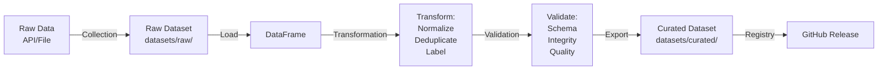

# Pipeline Architecture Guide

## Overview

StellarDataLab uses a simple 4-stage pipeline for all datasets:

```
Collection → Transformation → Validation → Export
```

## Stages

### 1. Collection

**Purpose**: Fetch raw data from external sources

**What happens**:
- Collection script runs (e.g., `scripts/collect_transactions.py`)
- Data fetched from API or file
- Raw data written to `datasets/raw/`
- No processing applied

**When to use**: 
- First time collecting a dataset
- Periodic updates (daily, weekly)

**Example**:
```bash
python scripts/collect_transactions.py
# Output: datasets/raw/transactions_2024_raw.csv
```

### 2. Transformation

**Purpose**: Normalize and process data

**What happens**:
- Address normalization (lowercase, validation)
- Timestamp normalization (ISO 8601, extract components)
- Deduplication (remove duplicate rows)
- Labeling (apply classification labels)

**Configuration**: YAML metadata file defines transformations

**Example**:
```yaml
transformations:
  - name: "normalize_addresses"
    type: "normalize_addresses"
    columns: ["sender", "receiver"]
  - name: "deduplicate"
    type: "deduplicate"
    key: ["tx_id"]
```

### 3. Validation

**Purpose**: Ensure data quality and correctness

**What happens**:
- Schema validation (JSON Schema)
- Integrity checks (duplicates, nulls)
- Semantic validation (domain-specific rules)
- Quality metrics (statistics, distributions)

**Result**: Report of validation issues (errors and warnings)

**Example**:
```python
from pipeline.validators import validate_dataframe_schema, check_integrity

result = validate_dataframe_schema(data, schema)
if result.is_valid:
    print("✓ Data valid")
else:
    print(f"✗ Errors: {result.errors}")
```

### 4. Export

**Purpose**: Save processed data for research use

**What happens**:
- Write curated data to CSV or JSON
- Generate dataset registry
- Tag release for download

**Output**: 
- `datasets/curated/{dataset}_curated.csv`
- `DATASETS.json` (registry)
- GitHub Release with packaged datasets

## Pipeline Flow



## Usage Examples

### Using the Orchestrator

```python
from pipeline import orchestrate_pipeline

# Process all datasets
result = orchestrate_pipeline("config.yml")
print(f"Success: {result['succeeded']}/{result['total']}")
```

### Using Individual Components

```python
import pandas as pd
from pipeline import normalize_addresses, deduplicate
from pipeline.validators import validate_dataframe_schema

# Load raw data
data = pd.read_csv("datasets/raw/transactions_raw.csv")

# Transform
data = normalize_addresses(data, ["sender", "receiver"])
data = deduplicate(data, key=["tx_id"])

# Validate
result = validate_dataframe_schema(data, schema)
if result.is_valid:
    # Export
    data.to_csv("datasets/curated/transactions_curated.csv")
```

## Configuration

Pipeline is configured via YAML dataset definitions:

```yaml
datasets:
  - name: "Transactions 2024"
    raw_path: "datasets/raw/transactions_2024_raw.csv"
    curated_path: "datasets/curated/transactions_2024_labeled.csv"
    schema: "schemas/transaction.schema.json"
    
    transformations:
      - name: "normalize"
        type: "normalize_addresses"
        columns: ["sender", "receiver"]
    
    integrity_rules:
      duplicate_key: ["tx_id"]
      required_fields: ["tx_id", "timestamp", "sender", "receiver", "amount"]
      reject_nulls: true
```

## Adding New Transformations

1. Add transformation function to `pipeline/transformers.py`
2. Document in `docs/labeling-guide.md` or `docs/schema-guide.md`
3. Add configuration example to metadata YAML

Example:
```python
def transform_custom(data, config):
    """Apply custom transformation."""
    # Implementation
    return data
```

## Error Handling

Errors at different stages:

- **Collection**: Logged, retry with backoff, skip if persistent
- **Transformation**: Logged, transformation halts with error
- **Validation**: Reported, dataset not exported if critical errors
- **Export**: Logged, dataset not released if export fails

## Performance

Pipeline performance depends on:
- Dataset size (rows)
- Transformation complexity
- Validation rules
- Network latency (for collection)

Typical times:
- Collection: Minutes to hours (API-dependent)
- Transformation: Seconds to minutes (pandas)
- Validation: Seconds to minutes (full scan)
- Export: Seconds (write to disk)

## Troubleshooting

**"Transformation failed"**
- Check input data format matches expected schema
- Verify transformation configuration
- Check Python version compatibility

**"Validation errors"**
- Review schema definition
- Check data values against constraints
- Inspect sample rows for issues

**"Export failed"**
- Check output directory exists and is writable
- Verify filename format
- Check disk space available
